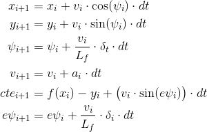

# CarND-Controls-MPC
Self-Driving Car Engineer Nanodegree Program

---
## Submission
This repository contains the code which I have submitted as part of the self-driving car nanodegree in term 2. In the following four sections I will answer questions relating my implementation.
For build instructions, see *Basic Build Instructions* at the end of this document.


## The Model
The trajectory of the vehicle is predicted using the bycycle model, i.e. we assume that the equations of motions are given by



where the state at some instance  is given by 6-tuple  and the actuator control signals by the pair . Notice that  is the distance function to the middle line of the road (which in our implementation was approximated by a polynomial of order 3).
The trajectory of the vehicle is predicted for a number of timesteps  with equidistant time intervals  between them.

The set of states is given by , the set of actuator inputs is .


## Timestep Length and Elapsed Duration
The time step length `dt` and the number of time steps `N` have been chosen to satisfy two requirements:

1. The predicted path shall cover the whole maneuver.  In the present setting, the controller shall mitigate road departure and align the vehicle to the center of the road.

2. The time of computation of the optimal trajectory shall be reduced as much as possible in order to reduce latency.

3. The time step length `dt` shall be short enough such that the spatial resolution of the predicted path is fine enough for a stable trajectory.

The first requirement sets both lower and upper bounds to the elapsed duration `N*dt`. For example, the screenshot below illustrates the typical situation where the vehicle has left the center of the road.


The red horizontal line illustrates where a cut-off of the planned trajectory could be made.  Approximately the last third of this trajectory (indicated by the red horizontal line) follows the center line and is therefore well behind the reasonable horizon. If there was any traffic, the situation could change within a few seconds completely and path planning would already be useless at these distant points.

The latter requirement poses an even greater challenge for embedded systems. ECUs (Electronic Controller Units) will never have the power of fairly modern desktop machines for a variety of reasons (power consumption, costs, durability).

Notice that the length of the predicted path varies with the speed of the vehicle as the predicted distance can be approximated by the sum .


## Polynomial Fitting and MPC Preprocessing
The waypoints (which are contained in a deque of length 6) are preprocessed by transforming them from the world coordinate system to the vehicle's coordinate system as follows:  If  is the heading of the vehicle, and  its global coordinates, define the two transformation matrices operating on homogeneous coordinates:


and


The whole transformation can then be expressed as


The waypoints in the vehicle's system are then fitted to a polynomial of order 3.


## Model Predictive Control and Latency
Latency, i.e. the time interval between the moment the signal is set by the ECU and the moment the actuators have arrived at their intended position, is incorporated into the controller by altering the initial state of the optimizer from the current measured state to a predicted state.

Let  be the latency (which is set by default to 100ms),   the current actuator positions, and  the current measured state.  The state of the vehicle at the time when the actuators will have reached their new position , is therefore given by


Of course, this is also only an approximation. The ECU itself needs some time to process the calculations.  Also, we assume that the actuators stay in the position  for the duration  and are then immediately set to .  However, these are still reasonable approximations.


## Dependencies

* cmake >= 3.5
 * All OSes: [click here for installation instructions](https://cmake.org/install/)
* make >= 4.1(mac, linux), 3.81(Windows)
  * Linux: make is installed by default on most Linux distros
  * Mac: [install Xcode command line tools to get make](https://developer.apple.com/xcode/features/)
  * Windows: [Click here for installation instructions](http://gnuwin32.sourceforge.net/packages/make.htm)
* gcc/g++ >= 5.4
  * Linux: gcc / g++ is installed by default on most Linux distros
  * Mac: same deal as make - [install Xcode command line tools]((https://developer.apple.com/xcode/features/)
  * Windows: recommend using [MinGW](http://www.mingw.org/)
* [uWebSockets](https://github.com/uWebSockets/uWebSockets)
  * Run either `install-mac.sh` or `install-ubuntu.sh`.
  * If you install from source, checkout to commit `e94b6e1`, i.e.
    ```
    git clone https://github.com/uWebSockets/uWebSockets
    cd uWebSockets
    git checkout e94b6e1
    ```
    Some function signatures have changed in v0.14.x. See [this PR](https://github.com/udacity/CarND-MPC-Project/pull/3) for more details.

* **Ipopt and CppAD:** Please refer to [this document](https://github.com/udacity/CarND-MPC-Project/blob/master/install_Ipopt_CppAD.md) for installation instructions.
* [Eigen](http://eigen.tuxfamily.org/index.php?title=Main_Page). This is already part of the repo so you shouldn't have to worry about it.
* Simulator. You can download these from the [releases tab](https://github.com/udacity/self-driving-car-sim/releases).
* Not a dependency but read the [DATA.md](./DATA.md) for a description of the data sent back from the simulator.


## Basic Build Instructions

1. Clone this repo.
2. Make a build directory: `mkdir build && cd build`
3. Compile: `cmake .. && make`
4. Run it: `./mpc`.
